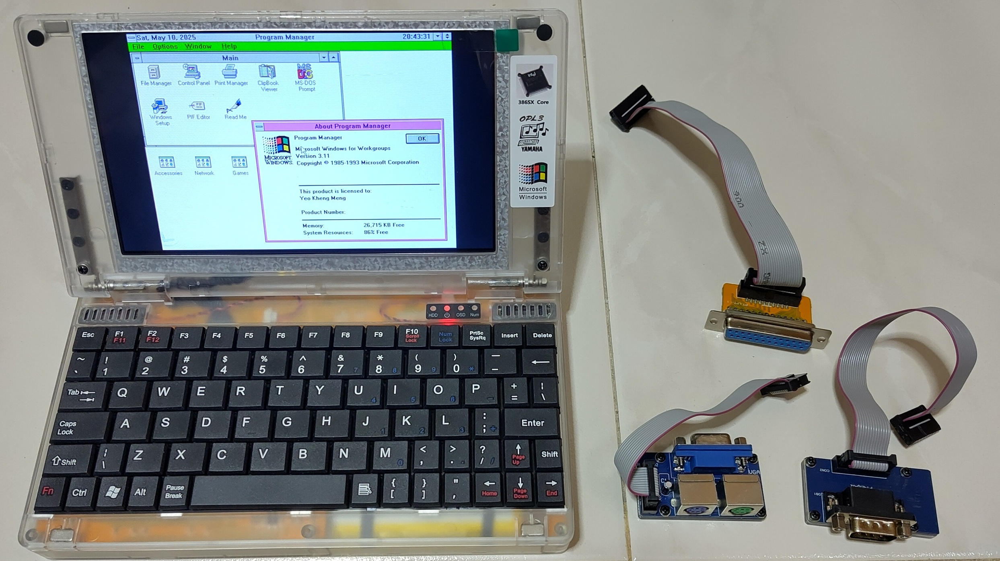

# Pocket386 (2024)

This is a new 386-based subnotebook released in 2024. It runs on DOS 6.22 and Windows for Workgroups (WFW) 3.11.

This setup and configuration is almost the same as the [Hand386](../hand386/).

## Specifications

* Ali M6117 with chipset (386SX-40)
* Cirrus Logic CL-GD5420
* YMF262-M OPL3 with YAC512 DAC
* OPL3-driven speakers
* PC-speaker
* 8MiB RAM
* 2500 mAh battery
* 16:9 Display
* Ports
  * CF card slot
  * USB port for flash drives
  * Connector for VGA output, PS/2 mouse and keyboard
  * Connector for 8-bit ISA bus extender
  * Connector for 16-bit ISA bus extender
  * Connector for serial port
  * Connector for parallel port
  * Headphone jack

## References

1. Manuals: https://8086cpu.com/lm4/100.html